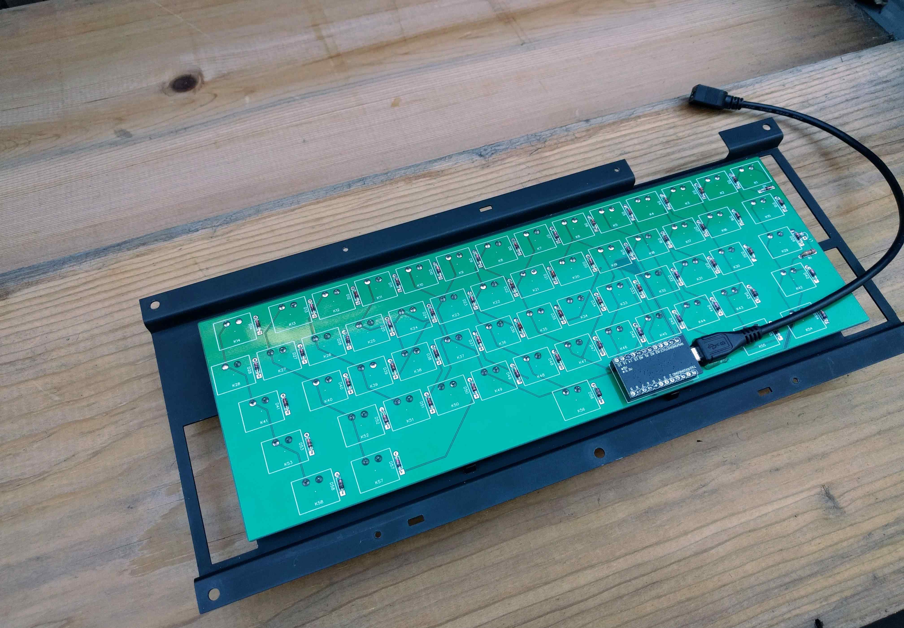
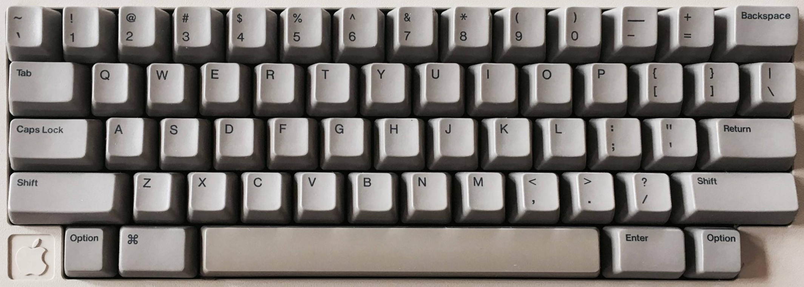

# M0110-EasyEDA
Files and notes from kludging together a drop-in replacement PCB for the Apple M0110 keyboard

PCB is available on EasyEDA – [M0110 PCB](https://oshwlab.com/cerement/M0110-PCB)

There’s a couple JSON files and a couple HEX files, I *think* the most recent are:
* AppleM0110_layout.json
* AppleM0110_firmware.hex

Back in 2018, I had the best luck building the firmware at https://kbfirmware.com/

If you want to rebuild the firmware, the JSON file above should have the pinout/matrix and the layout

The rest of the files were documenting the pinouts and the matrix when using a ProMicro as the microcontroller

[Gallery](https://imgur.com/a/IDL6cTn)

